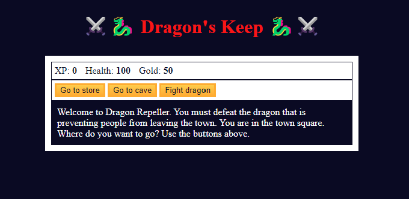

# Dragon's Keep

**Dragon's Keep** is a simple yet engaging RPG game where players embark on a quest to defeat a fearsome dragon threatening a town. Navigate through different locations, manage your resources, and battle various monsters to achieve victory.

## Table of Contents

- [Tools Used](#tools-used)
- [How to Play](#how-to-play)
- [Gameplay Image](#gameplay-image)
- [Code Overview](#code-overview)

## Tools Used

### HTML
- **index.html**: This file contains the structure of the game's user interface, including the layout for stats, controls, and messages.

### CSS
- **styles.css**: This file defines the styling of the game, including the colors, layout, and design of buttons and text.

### JavaScript
- **script.js**: This file contains the game logic, including functions for navigating locations, fighting monsters, and managing player stats and inventory.

## How to Play

1. **Start the Game**: Open the game in a web browser. You will start in the town square.
2. **Navigate Locations**: Use the buttons to go to the store, enter the cave, or fight the dragon.
   - **Go to Store**: Buy health or weapons to prepare for battles.
   - **Go to Cave**: Fight lesser monsters to gain experience (XP) and gold.
   - **Fight Dragon**: Engage in a battle with the dragon.
3. **Manage Resources**: Keep an eye on your XP, health, and gold displayed at the top.
   - **XP**: Increases as you defeat monsters.
   - **Health**: Decreases when you take damage; can be restored by buying health at the store.
   - **Gold**: Earned by defeating monsters and can be used to buy items at the store.
4. **Combat**: 
   - **Attack**: Use your weapon to attack the monster.
   - **Dodge**: Attempt to dodge the monster’s attack.
   - **Run**: Retreat to the town square.
5. **Win or Lose**: Defeat the dragon to win the game, or lose if your health drops to zero.

## Gameplay Image

## Code Overview

### index.html

The HTML structure includes:
- **Stats**: Displays XP, health, and gold.
- **Controls**: Buttons to navigate to different locations.
- **Monster Stats**: Displays monster information during battles.
- **Text**: Provides narrative and instructions to the player.

### styles.css

CSS styles include:
- **Body**: Dark background to create an immersive experience.
- **Game Container**: Centrally aligned game area with defined dimensions.
- **Buttons and Text**: Styled to ensure readability and user engagement.

### script.js

Key JavaScript functions:
- **update(location)**: Updates the UI based on the current location.
- **goTown() / goStore() / goCave()**: Functions to navigate between locations.
- **buyHealth() / buyWeapon()**: Functions to purchase health or weapons.
- **fightSlime() / fightBeast() / fightDragon()**: Functions to initiate battles with different monsters.
- **attack() / dodge() / defeatMonster() / lose() / winGame()**: Combat functions handling attacks, dodging, and battle outcomes.
- **restart()**: Resets the game to initial state.
- **easterEgg() / pickTwo() / pickEight() / pick(guess)**: Hidden mini-game logic.

Enjoy your adventure in Dragon's Keep'! Defeat the dragon and save the town!
